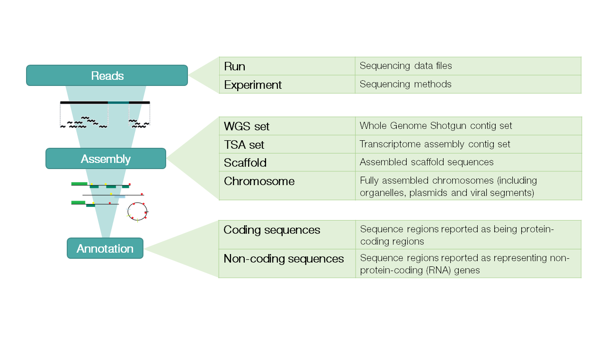

===========
ENA Content
===========

The European Nucleotide Archive (ENA) captures and presents information relating to experimental workflows that are
based around nucleotide sequencing. A typical workflow includes the isolation and preparation of material for
sequencing, a run of a sequencing machine in which sequencing data are produced and a subsequent bioinformatic analysis
pipeline. ENA records this information in a data model that covers input information (sample, experimental setup,
machine configuration), output machine data (sequence traces, reads and quality scores) and interpreted information
(assembly, mapping, functional annotation).

Data arrive at ENA from a variety of sources. These include submissions of raw data, assembled sequences and annotation
from small-scale sequencing efforts, data provision from the major European sequencing centres and routine and
comprehensive exchange with our partners in the International Nucleotide Sequence Database Collaboration (`INSDC <http://www.insdc.org>`_).

Provision of nucleotide sequence data to ENA or its INSDC partners has become a central and mandatory step in the
dissemination of research findings to the scientific community. ENA works with publishers of scientific literature and
funding bodies to ensure compliance with these principles and to provide optimal submission systems and data access
tools that work seamlessly with the published literature.

ENA is organised into three tiers: reads, assemblies and annotations.

Data from the ENA tiers are organised into domains. See `here <https://ena-docs.readthedocs.io/en/latest/retrieval/general-guide.html>`_ 
for the full list of ENA data domains with descriptions and example records.

Although the ENA has almost 30 years of history, the data and services are constantly changing to reflect growing
volumes of data, ever improving sequencing technology and the broadening of applications to which sequencing is now
put. Latest developments and changes to services are announced `here <https://www.ebi.ac.uk/ena/browser/about/news>`_ and
users are encourage to join the ENA mailing list  `ena-announce <http://listserver.ebi.ac.uk/mailman/listinfo/ena-announce>`_.

As part of the global effort to improve access to and usability of nucleotide sequencing data, we collaborate
extensively in the development of our services and technologies and in standards activities.

*The ENA is developed and maintained at the EMBL-EBI under the guidance of the INSDC International Advisory Committee*
*and a Scientific Advisory Board.*
