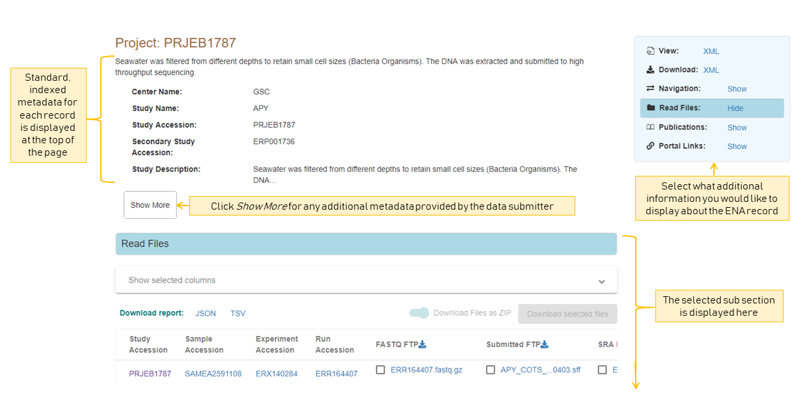
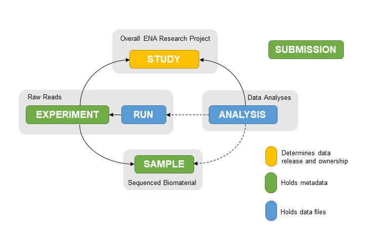

===================
Viewing ENA Records
===================

ENA Records
===========

You can view any public ENA records using their Accession (unique identifier) or
as the result of a search.

Exploring an ENA record
-----------------------

All records have a selection of standard, indexed metadata which tells you about the
database entry. For example, where it is submitted, basic information on the record's
title and description etc. To show the full set of indexed metadata for this record,
you can click *Show More*. For additional custom metadata provided by the submitter,
you can view this in the ENA record XML.

To explore a record further, you can use the navigation box in the top right of the view
to show/hide different additional subsections of information.

This gives you access to any other associated data, such as if a project has any data
files or publications associated with it.

Any links that looks like *accessions* (a series of letters then numbers) will take you
to an associated record.

An ENA record can be one of the following types:

Record types
------------

+-----------------------+---------------------------------------------+---------------------------+
| **Record Type**       | **Description**                             | **Example accessions**    |
+-----------------------+---------------------------------------------+---------------------------+
| Projects/Studies      | | Contains information on a biological      | `PRJEB1787/ERP001736`_    |
|                       | | research project. This holds all the data |                           |
|                       | | generated as part of this research.       |                           |
+-----------------------+---------------------------------------------+---------------------------+
| Samples               | | Represents biological samples collected   | `SAMEA2620084/ERS488919`_ |
|                       | | and sequenced in real life                |                           |
+-----------------------+---------------------------------------------+---------------------------+
| Runs/Experiments      | Hold raw read files and sequencing methods  | `ERR1701760/ERX1772048`_  |
+-----------------------+---------------------------------------------+---------------------------+
| Analyses              | | Hold results files of analyses performed  | `ERZ841272`_              |
|                       | | on sequencing data and analysis methods   |                           |
+-----------------------+---------------------------------------------+---------------------------+
| WGS contig set        | | Hold Whole Genome Sequencing contig sets  | `CABHOY010000000.1`_      |
|                       | | generated as part of a genome assembly.   |                           |
|                       | |                                           | `CABHOY010000000`_        |
|                       | |                                           |                           |
|                       | |                                           | `CABHOY01`_               |
+-----------------------+---------------------------------------------+---------------------------+
| Assemblies            | | Represents an entire genome assembly and  | `GCA_000001405.28`_       |
|                       | | holds any contig sets or sequence records |                           |
|                       | | generated as part of the assembly         |                           |
+-----------------------+---------------------------------------------+---------------------------+
| | Assembled/Annotated | | Any sequence records from coding or       | `CM000667.2`_             |
| | Sequences           | | non-coding regions to full assembled      |                           |
|                       | | chromosomes                               |                           |
+-----------------------+---------------------------------------------+---------------------------+
| Taxon                 | | The sequenced organism or metagenome of a | `Taxon:9606`_             |
|                       | | sample                                    |                           |
+-----------------------+---------------------------------------------+---------------------------+
| Sample Checklist      | | The checklist of metadata that the sample | `ERC000013`_              |
|                       | | was registered with                       |                           |
+-----------------------+---------------------------------------------+---------------------------+

.. _`PRJEB1787/ERP001736`: https://www.ebi.ac.uk/ena/browser/view/PRJEB1787
.. _`SAMEA2620084/ERS488919`: https://www.ebi.ac.uk/ena/browser/view/SAMEA2620084
.. _`ERR1701760/ERX1772048`: https://www.ebi.ac.uk/ena/browser/view/ERR1701760
.. _`ERZ841272`: https://www.ebi.ac.uk/ena/browser/view/ERZ841272
.. _`CABHOY010000000.1`: https://www.ebi.ac.uk/ena/browser/view/CABHOY010000000.1
.. _`CABHOY010000000`: https://www.ebi.ac.uk/ena/browser/view/CABHOY010000000
.. _`CABHOY01`: https://www.ebi.ac.uk/ena/browser/view/CABHOY01
.. _`GCA_000001405.28`: https://www.ebi.ac.uk/ena/browser/view/GCA_000001405.28
.. _`CM000667.2`: https://www.ebi.ac.uk/ena/browser/view/CM000667.2
.. _`Taxon:9606`: https://www.ebi.ac.uk/ena/browser/view/Taxon:9606
.. _`ERC000013`: https://www.ebi.ac.uk/ena/browser/view/ERC000013

View and Download Links
=======================

This panel contains the different data formats available for the current record.

Contigset (WGS/TLS/TSA)
-----------------------

- View/Download flatfile for the master record describing the set

  - EMBL `https://www.ebi.ac.uk/ena/browser/api/embl/CABHOY010000000 <https://www.ebi.ac.uk/ena/browser/api/embl/CABHOY010000000>`_

- Download the full set of sequences in one file (Using ftp:// is recommended for programmatic downloads)

  - EMBL (from FTP) `ftp://ftp.ebi.ac.uk/pub/databases/ena/wgs/public/cab/CABHOY01.dat.gz <http://ftp.ebi.ac.uk/pub/databases/ena/wgs/public/cab/CABHOY01.dat.gz>`_
  - FASTA (from FTP) `ftp://ftp.ebi.ac.uk/pub/databases/ena/wgs/public/cab/CABHOY01.fasta.gz <http://ftp.ebi.ac.uk/pub/databases/ena/wgs/public/cab/CABHOY01.fasta.gz>`_
  - FASTA (via API) `https://www.ebi.ac.uk/ena/browser/api/fasta/CABHOY010000000 <https://www.ebi.ac.uk/ena/browser/api/fasta/CABHOY010000000>`_

Project/Sample/Run/Analysis/Submission (XML types)
--------------------------------------------------

- View/Download metadata in XML format

  - `https://www.ebi.ac.uk/ena/browser/api/xml/PRJEB402 <https://www.ebi.ac.uk/ena/browser/api/xml/PRJEB402>`_

Assembly (Genome Collection)
----------------------------

- View/Download metadata in XML format

  - `https://www.ebi.ac.uk/ena/browser/api/xml/PRJEB402 <https://www.ebi.ac.uk/ena/browser/api/xml/PRJEB402>`_

- View/Download Sequence report as a text file

  - `ftp://ftp.ebi.ac.uk/pub/databases/ena/assembly/GCA_900/GCA_900257/GCA_900257145.2_sequence_report.txt <ftp://ftp.ebi.ac.uk/pub/databases/ena/assembly/GCA_900/GCA_900257/GCA_900257145.2_sequence_report.txt>`_

- Download all sequences in the assembly, including chromosomes, WGS set and scaffolds as one file

  - EMBL `https://www.ebi.ac.uk/ena/browser/api/embl/GCA_900257145.2?download=true&gzip=true <https://www.ebi.ac.uk/ena/browser/api/embl/GCA_900257145.2?download=true&gzip=true>`_
  - FASTA `https://www.ebi.ac.uk/ena/browser/api/fasta/GCA_900257145.2?download=true&gzip=true <https://www.ebi.ac.uk/ena/browser/api/fasta/GCA_900257145.2?download=true&gzip=true>`_

Navigation and Cross References
===============================

From here you can navigate through all associated records that were submitted within the same
submission Project.

Organisation of a Project in ENA
--------------------------------

When data is submitted to the archive, the data submitter establishes relationships
between each record in a research project following the ENA metadata model:

This is so someone viewing the data can easily navigate between the records.
This makes it easy to explore the data generated from biological samples which were
sequenced/analysed within the same research project.

Cross-references
----------------

From this tab you can also see any links from the record out to external data resources
that have used or generated these records as part of their services. These mappings are compiled
as part of ENA's cross-reference service, and so only show data from resources that are
registered with us. You can see more details on such
registered resources `here <https://www.ebi.ac.uk/ena/browser/xref>`_.

*Note: This view only gives a view of the associated records submitted as part of the
originally submitted research project and any registered cross-references. For a view
showing all ENA records which are associated with this record (including any other
links to this record within other ENA submission projects), you can see this in the Related ENA Records
tab (available for Project, Sample and Taxon records).*

Read Files
==========

Display and download any associated raw read files.
Please refer to `Archive Generated Files <https://ena-docs.readthedocs.io/en/latest/faq/archive-generated-files.html>`_
for more information about file formats.

There are several ways to download read files:

1.  Using ENA File Downloader Command Line Tool
-----------------------------------------------
The ENA File Downloader is a new Java based command line application. You have to
submit one or more comma separated accessions, or a file with accessions that you
want to download data for. This tool allows downloading of read and analysis files,
using FTP or Aspera. It has an easy to use interactive interface and can also create
a script which can be run programmatically or integrated with pipelines.

Download the latest version from
`ENA Tools <http://ftp.ebi.ac.uk/pub/databases/ena/tools/ena-file-downloader.zip>`_.

2. File Reports
---------------
You can download a Report of all the data displayed in the table or download files selected
from the table. To download all files in the column, click the download icon in the table
header.

To choose additional metadata to add to the table display and report, use the 'Show selected
columns' expandable menu.

3. enaBrowserTools
------------------
You can also download files from ENA using the Python based scripts `enaBrowserTools <https://github.com/enasequence/enaBrowserTools>`_.

Analysis Files
==============

Display and download any associated analysis files. There are three ways to download analysis files:

1.  Using ENA File Downloader Command Line Tool
-----------------------------------------------
The ENA File Downloader is a new Java based command line application. You have to
submit one or more comma separated accessions, or a file with accessions that you
want to download data for. This tool allows downloading of read and analysis files,
using FTP or Aspera. It has an easy to use interactive interface and can also create
a script which can be run programatically or integrated with pipelines.

Download the latest version from
`ENA Tools <http://ftp.ebi.ac.uk/pub/databases/ena/tools/ena-file-downloader.zip>`_.

2. File Reports
---------------
You can download a Report of all the data displayed in the table or download files selected
from the table. To download all files in the column, click the download icon in the table
header.

To choose additional metadata to add to the table display and report, use the 'Show selected
columns' expandable menu.

3. enaBrowserTools
------------------
You can also download files from ENA using `enaBrowserTools <https://github.com/enasequence/enaBrowserTools>`_.

Publications
============

Explore publications that either cite the record or document the research
where the record was generated.

This view provides links to the DOI or in some cases, a direct link to the PDF or article in
Europe PMC.

Component Projects
==================

In the case of an **Umbrella Project** (a project which is used to group many related
sub-projects) there is the option to explore its Component Projects.

Component projects are the same as other project records in ENA but are grouped under one
'umbrella' meaning they will often have the same research motivation and will often represent
a collaborative research effort.

Parent Projects
===============

If a project has a parent project it is part of an **Umbrella Project** (a project which is used to
group many related sub-projects).

Projects grouped under one 'umbrella' often have the same research motivation and will often represent
a collaborative research effort. You can navigate to the parent project through this tab and view
other related component projects through the 'Component Projects' tab.

Related ENA Records
===================

This view provides a summary of all data associated with this record. Any submission in
ENA that is associated with this record is available here.

This view is only available for three ENA record types:

**Study**: Here you can find all components of the project including any sequence or
assembly records associated with the project.

**Sample**: Here you can find all sequencing records or analyses associated with the
sample including assembly or sequence records. This view shows any third party uses
of the sequencing data registered with ENA.

**Taxon**: Here you can see a summary of all ENA records registered with that particular
taxon. This view also shows a summary of any records registered with descendant taxa.

Tax Tree
========

Here you can view the full tax tree of this taxon record.

From this view you can access all taxon records within this tax tree and explore ENA
records that are registered with related taxa.

Click the arrows to expand the tree and explore the full lineage of the taxon.

Assembly Versions
=================

If this assembly has been updated, you can view the past assembly versions here.

Assembly Statistics
===================

Assembly statistics are generated for all assemblies submitted to INSDC.

**Total Length** (total sequence length) - total length of all top-level sequences.

**Ungapped Length** (total ungapped length) - total length of all top-level sequences
ignoring gaps. Any stretch of 10 or more Ns in a sequence is treated like a gap.

**Chromosomes & Plasmids** (total number of chromosomes and plasmids) - total number
of chromosomes, organelle genomes, and plasmids in the assembly.

**Spanned Gaps** - total number of gaps between contigs/scaffolds.

**Unspanned Gaps** - total number of unspanned gaps between scaffolds.

**Regions/Patches/Alternative Loci** - (number of regions with alternate loci or
patches) - number of genomic regions that contain one or more alternate loci or
patch scaffolds.

**Scaffolds** (number of scaffolds) - number of scaffolds including placed,
unlocalized, unplaced, alternate loci and patch scaffolds.

**Scaffold N50** - length such that scaffolds of this length or longer include
half the bases of the assembly.

**Contigs** (number of contigs) - total number of sequence contigs in the assembly.
Any stretch of 10 or more Ns in a sequence is treated as a gap between two contigs
in a scaffold when counting contigs and calculating contig N50 & L50 values.

**Contig N50** - length such that sequence contigs of this length or longer include
half the bases of the assembly.

Chromosomes
===========

When an assembly is is declared as assembled to full chromosome level on
submission, chromosome sequences are generated for each chromosome submitted
in the assembly.

These chromosomes are available as individual sequence records and can be
explored in full here.

BlobToolKit
===========

BlobToolKit is a set of computational tools developed to identify cross-species contamination within genome assemblies.
A summary of results and graphics generated by BlobToolKit is displayed on the ENA browser to give data providers and consumers
access to visualisation tools needed to identify contamination in public genome assembly data. BlobToolKit was developed by
Richard Challis & Mark Blaxter at the University of Edinburgh.

For further information regarding BlobToolKit, please visit https://blobtoolkit.genomehubs.org.

Please send any questions or queries regarding BlobToolKit to blobtoolkit@genomehubs.org.

Checklist Fields
================

Sample Checklists are lists of fields that are required/recommended to be used
during registration to describe samples (depending on the type of sample).

Explore the mandatory, recommended and optional fields defined as part of this
checklist.

You can filter these fields further by requirement or by keywords in the field
name or description.

In some cases, fields can be restricted by regular expression, a list of text
choices, by valid taxonomy or by valid ontology terms.

3rd Party Curations
===================

This tab presents the flow of 3rd party curations from the ELIXIR Contextual Data ClearingHouse (CDCH) data store.

The CDCH data store aims to provide a seamless method of exchange for curated contextual data available in external resources and community curation efforts, with ELIXIR data resources.

Chromosome Download Script
===========

The script automates the download of all chromosomes for the given assembly ID. If
any chromosome is part of the WGS set, the script will download full WGS file from
ENA FTP location and will extract only relevant sequences associated with the given assembly.

