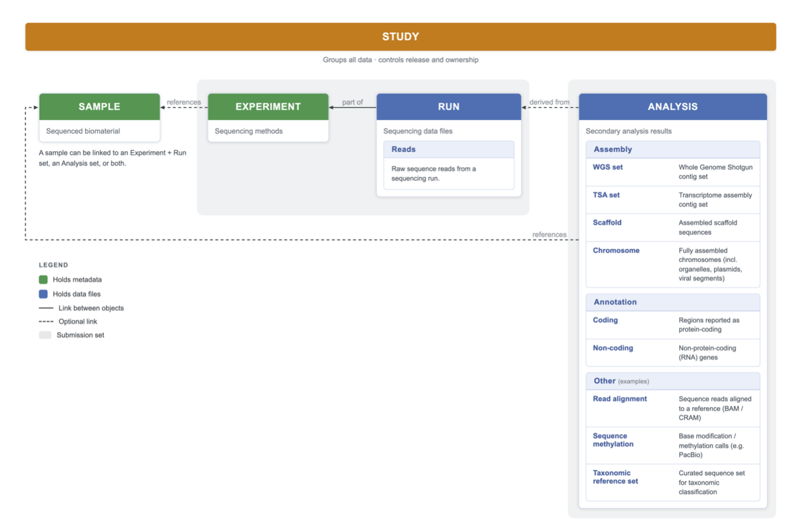

=================
What ENA contains
=================

ENA captures the full record of a nucleotide sequencing experiment: the sequence data it generates, together with the contextual metadata describing the biological material and experimental setup behind it.

The ENA data model
==================

This content is organised into three tiers (raw reads, the sequence assemblies built from them, and functional annotation), with each record described by a set of linked objects (study, sample, experiment, run and analysis) that tie the data together.

ENA's data model is aligned with the standards shared across the INSDC. INSDC partners follow a common set of `INSDC minimal specifications <https://www.insdc.org/insdc-minimal-specifications/>`_ that define how each type of record is structured, and they exchange newly submitted data daily. A record submitted to any one archive therefore becomes part of a shared collection held by all partners and can be retrieved from any of them.

Third-party data (TPA)
----------------------
Third-party data (TPA) are submitted to the INSDC as part of publishing studies that assemble or annotate existing INSDC reads and primary sequences. Public TPA records are therefore tied to one or more publications that document how the data were derived, supported by peer-reviewed evidence.

The ENA Content team reviews and assists with TPA submissions case by case; contact ENA if you have a record that fits this description. Because TPA records are derived from public INSDC read or sequence data that the submitter does not own, they follow a strict release policy: the dataset should be planned for publication in a peer-reviewed journal that discusses the records unambiguously and covers (re-)annotation, (re-)assembly, or both. Once accepted, the records must be cited by accession number in that article.